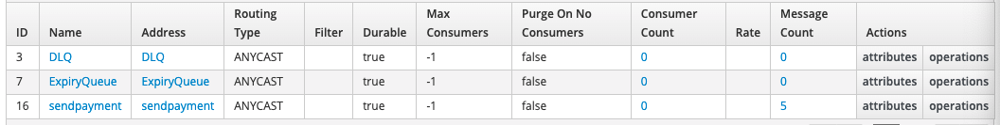

# Karavan Saga Demo

In this sample Demo I will be implementing a Saga Pattern using [Apache Camel Karavan](https://github.com/apache/camel-karavan).


## Setup environment for local Development using VS Code
* [VS Code Extension](https://marketplace.visualstudio.com/items?itemName=camel-karavan.karavan)
* AMQ Local ( 2 options )
    * [Apache ActiveMQ](https://activemq.apache.org/components/artemis/download/)
    * [Red Hat AMQ Broker](https://developers.redhat.com/products/amq/download)
* [JBang](https://www.jbang.dev/download/) to run locally


## Demo

#### Setup ActiveMQ 

1. Download and install your preferred version of Active MQ. For the purpose of this demo I will be using the Red Hat AMQ Broker version. To install unzip the download archive on your computer in your your preferred location.

1. Go to into the AQM-Broker folder

1. Create and new folder to receive the broker
    > mkdir opt/
1. Change to the new folder
    > cd opt/

1. Create a new broker *broker* using the artimis script with the *artemis create* command:
    > ../bin/artemis create broker 

    * Follow the prompt using the folowwing credential to configure the broker.
        * username: __admin__
        * password: __admin001__
        * Allow anonymous access: __Y__
        
1. Start the broker instance, using the one of the following option.
    1. Run the broker using the  *run* command. This will start the broker in the foreground.
        ```
        <install-folder>/opt/broker/bin/artemis run 
        ```
    2. Start the broker in background or as a service.
        ```
        <install-folder>/opt/broker/bin/artemis-service start 
        ```

1. You can now access the WebConsole using the following url and the user/password used before.
    *http://localhost:8161/console*


#### Create a queue

To create a queue we need to edit the *broker.xml* file

1. Start by moving to the right repositpry
    ```
    <install-folder>/opt/broker/etc
    ```

1. Using you favorite editor open the broker.xml file.

1. Locate the *addresses* section.


1. Add a new address and queue of type anycast. Address and queue name is *sendpayment*
    ```
    <address name="sendpayment">
        <anycast>
            <queue name="sendpayment" />
        </anycast>
    </address>
    ```
Result after editing the file
    


#### Producing and Consuming messages

Now that we have created the needed queue, let's test that we can produce and consume message to that queue.

Before we start make sure their is no messages in the queues.


###### Produce message

Let's produce 5 messages into the sendpayment queue using the following curl command. 
```
<install-folder>bin/artemis producer --destination sendpayment --message-count 5 --url tcp://localhost:61616
```

Result:



###### Consume message
Let's consume 3 messages into the sendpayment queue using the following curl command. 
```
<install-folder>bin/artemis consume --destination sendpayment --message-count 3 --url tcp://localhost:61616
```

Result:


Consume the remaining messages.
```
<install-folder>bin/artemis consume --destination sendpayment --message-count 2 --url tcp://localhost:61616
```

:warning: Now all queues shoul be back to 0. As per the first image.


#### Create and integration using VS Code and the Karavan plugin

1. Open VS Code
1. In a new Project create your integration.yaml file
1. Right click on the file and select Karavan:Open.  This will open the Kavavan designer


1. Select a new Route with AMQ Kamelet.
